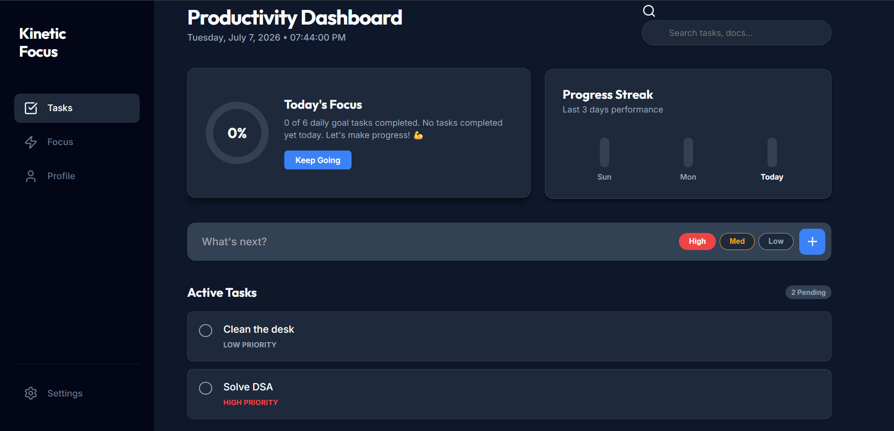
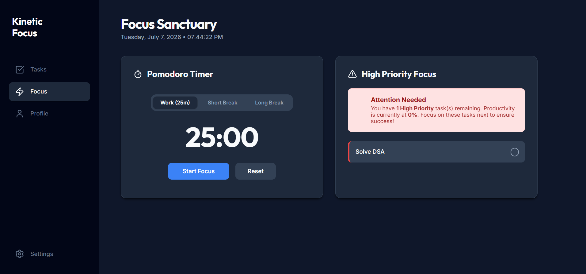
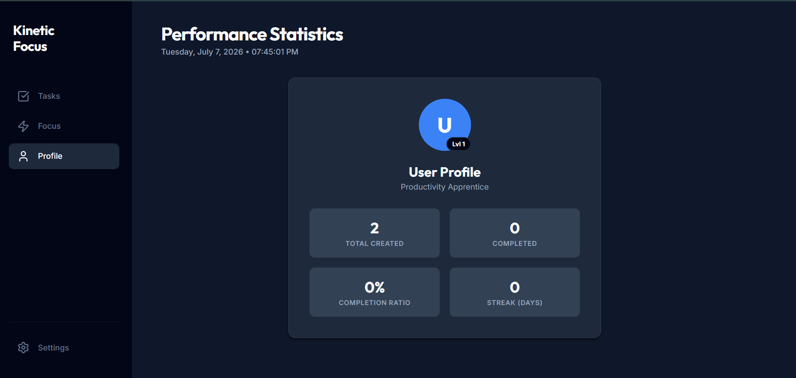

# Kinetic Focus

A modern productivity dashboard built using HTML, CSS, and JavaScript to help users organize tasks, stay focused, and track daily productivity.

## ✨ Features

- Add, edit, delete, and complete tasks
- Task priorities (High, Medium, Low)
- Search tasks
- Pomodoro timer with work and break modes
- Daily productivity tracker
- Progress streak visualization
- User profile statistics
- Dark mode
- Local Storage support
- Responsive dashboard design

## 🛠️ Tech Stack

- HTML5
- CSS3
- JavaScript (ES6 Modules)
- Local Storage API
- Responsive Web Design

## 📂 Project Structure

```
index.html
style.css
app.js
tasks.js
storage.js
timer.js
ui.js
```

## 🚀 Live Demo

https://anushkaguptacg-a11y.github.io/kinetic-focus/

## 📸 Screenshots

### Dashboard



### Focus Sanctuary



### Performance Statistics



## 🔮 Future Improvements

- User authentication
- Cloud database integration
- Task categories
- Calendar integration
- Notifications and reminders

## 👩‍💻 Author

**Anushka Gupta**

GitHub: https://github.com/anushkaguptacg-a11y
